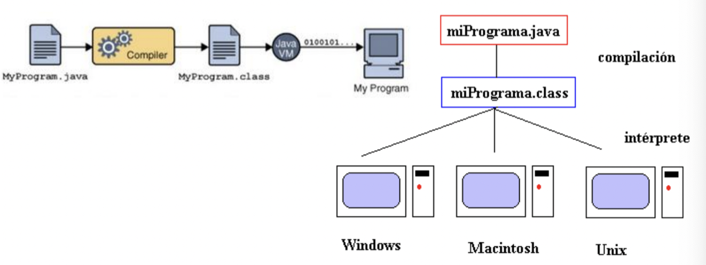
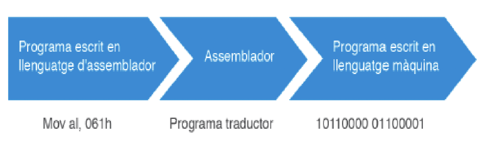
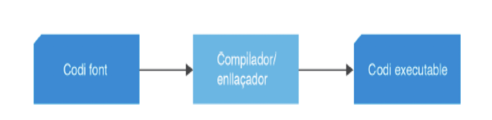

# ___Tema 1___
---
## __1. Introducción al desarrollo de software__
### __1.1 Concepto de programa informático__

__Programa__: Conjunto de eventos ordenados que suceden de manera secuencial en el tiempo (uno tras otro).

Por ejemplo, en los electrodomésticos, lo que ejecuta son un conjunto de órdenes que la máquina sigue ordenadamente. Una vez se selecciona el programa, el electrodoméstico hace todas las tareas de manera autónoma.

En el caso de que las órdenes no se realicen de la forma establecida, el resultado no será el deseado.

__Programa en TI:__
> Una serie de órdenes que se llevan a cabo secuencialmente, 
> aplicadas sobre un conjunto de datos

Dependiendo del programa, procesa diferentes tipos de datos:

* Un navegador web procesa las órdenes del usuario y los datos que recibe desde un servidor.
* Un reproductor de vídeo procesa los fotogramas almacenados en un archivo y el audio relacionado.
* Un editor prpocesa los datos de un documento de texto.
* Una hoja de cálculo procesa datos numéricos.

Por lo tanto, la tarea de un __programador__ es:

1. Escoger las órdenes que constituirán el programa.
2. En qué orden se deben llevar a cabo.
3. Sobre qué datos hay que aplicar las órdenes para que el programa sea efectivo.

### __1.2 Código fuente, código objeto y código ejecutable: Máquinas virtuales__
---

Un ordenador es una máquina binaria que solo trabaja con 0 y 1: __Lenguaje máquina__.

Este código puede ser de un __nivel muy alto__ (cerca del lenguaje humano) o de un __nivel muy bajo__ (lenguaje máquina).

Hoy en dia, se programa con lenguajes de nivel alto, pero el procesador no entiende ese lenguaje, por lo tanto, se necesita de un proceso de traducción del código fuente.

Ese proceso de traducción se denomina __compilación__, que es la traducción del código fuente de los archivos en ficheros de formato binario. 

El programa que realiza esta tarea es el __compilador__.

---
> El __código fuente__ es el conjunto de archivos de texto resultantes, donde se encuentran las instrucciones.
---
> El __código objeto__ es el código fuente traducido por el 
> compilador, pero que aún no puede ser ejecutado por el ordenador.
---
> El __código ejecutable__ es la traducción completa en código 
> maquina (llevada a cabo por el __enlazador__).
---
> El __enlazador__ se encarga de insertar al __código objeto__ las funciones de las __librerías__ que son necesarias para el programa y de llevar a cabo el proceso de montaje generando un archivo ejecutable.
---
> Una __librería__ es una colección de código predefinido que facilita la tarea del programador a la hora de codificar un programa.
---

El orden que se toma para traducir el código fuente y que el ordenador lo ejecute sería:

    Código fuente -> Compilador -> Código objeto -> Enlazador -> Código ejecutable

---

El concepto de __máquina virtual__ surge con el objetivo de facilitar el desarrollo de compiladores que generan código para diferentes procesadores.

La __compilación__ consta de dos dos fases:

* Pasa el código fuente en un lenguaje intermedio que no puede ser directamente ejecutado.

* Traduce el lenguaje intermedio al lenguaje máquina.

Se realiza en dos fases porque el objetivo es que en la primera fase, el código intermedio sea común para cualquier procesador y que el código que se genere en la segunda fase sea el específico para cada procesador.

La traducción del lenguaje intermedio se hace mediante un __intérprete__:

Ese intérprete en Java es una máquina virtual, la __Java Virtual Machine(JVM)__, que se posiciona en un nivel superior al sistema operativo sobre el que se desea ejecutar la aplicación. Se encarga de convertir el código de bytes (lenguaje intermedio) a código nativo del sistema operativo.

### __1.3 Tipos de lenguajes de programación__
---

Un lenguaje de programación es un lenguaje que permite establecer una comunicación entre el programador y la máquina. Identificará el código fuente desarrollado por el programador para indicar las instrucciones que debe realizar, una vez se haya convertido en código ejecutable.

Los diferentes tipos de lenguajes son:

* Lenguaje de 1ª generación o lenguaje máquina.
* Lenguaje de 2ª generación o lenguaje ensamblador.
* Lenguaje de 3ª generación o lenguaje de alto nivel.
* Lenguaje de 4ª generación o lenguaje de propósito específico.
* Lenguaje de 5ª generación.

---

#### __Lenguaje de 1ª generación:__

__Ventajas:__

* Es el único lenguaje que entiende el ordenador directamente.
* Las instrucciones se expresan en __código binario__.
* Alta eficiencia debido a que el programador utiliza la totalidad de recursos del hardware.

__Desventajas:__

* Se requiere un profundo conocimiento de la arquitectura física del ordenador, por lo tanto, un programa realizado en este lenguaje solo funcionará con máquinas que tengan exactamente las mismas características.
* Es un lenguaje obsoleto, está prácticamente en desuso.

---

#### __Lenguaje de 2ª generación:__

* Introduce los códigos __mnemotécnicos__ para indicar a la máquina las operaciones que debe llevar a cabo:
---
> En lugar de:    00010100110011101 -> Sumar 3 + 5 y guardar el resultado en un registro concreto.
---
> Pasa a:         SUMA A0 3 5 
---

Cada instrucción en lenguaje ensamblador corresponde a una instrucción en lenguaje máquina. Estos lenguajes dependen totalmente del procesador que utilice las máquinas.

A partir del código escrito en lenguaje ensamblador, el programa traductor lo convierte en código de primera generación.

Se suele utilizar para __programar drivers__ o __aplicaciones de tiempo real__, ya que requiere un uso muy __eficiente__ de la velocidad y de la memoria.

__Ventajas:__

* Permiten escribir programas muy optimizados.
* Permite al programador especificar exactamente qué instrucciones quiere que se ejecuten.

__Desventajas:__

* Los lenguajes de bajo nivel están ligados al hardware donde se ejecutarán y no se pueden transladar fácilmente a otros sistemas con un hardware diferente.

* Hay que conocer a fondo la arquitectura del sistema.

* No permiten expresar de forma directa conceptos habituales a nivel de algoritmo.

* Son difíciles de codificar, documentar y mantener.

---

#### __Lenguajes de 3ª generación:__

Utilizan palabras y frases relativamente fáciles de entender y proporcionan también facilidades para expresar alteraciones del flujo de control de una forma sencilla e intuitiva.

Se utilizan cuando se quieren desarrollar aplicaciones grandes y complejas, donde se prioriza el hecho de facilitar y comprender cómo hacer las cosas por encima del rendimiento del software.

* Surgen de hacer la tarea de __programación independiente de la máquina__ donde se ejecutarán.

* Son fáciles de aprender porque se asimilan al lenguaje humano.

* Ejemplos de lenguajes de 3ª programación: __C, C++, Pascal, FORTRAN, ALGOL, COBOL, BASIC, Python.__

Como consecuencia de que estos lenguajes se acerquen al lenguaje humano, no pueden ser directamente interpretados por la máquina, por lo tant hay dos tipos de traductores que se encargan de pasar el lenguaje de 3ª generación a lenguaje máquina: los __compiladores__ y los __intérpretes__.

__Compiladores__

* Son programas que traducen el código fuente a lenguaje máquina.
* El compilador detecta posibles errores del programa fuente para conseguir un programa ejecutable depurado.
* El código ejecutable depende de cada SO. Por lo tanto, si se quiere ejecutar el código con el SO se debe recompilar el código fuente.
* El programa resultante se ejecuta directamente desde el SO.

Tiene una dependencia del sistema operativo a la hora de elegir y utilizar el compilador.

__Intérpretes__

A diferencia del compilador, el intérprete __traduce el código en tiempo de ejecución__, es decir, no se hace un proceso previo de traducción de todo el programa fuente a código de bytes, si no que se __traduce y ejecuta instrucción por instrucción__.

* El código interpretado no es ejecutado directamente por el SO, si no que hace uso de un intérprete.
* Cada sistema tiene su propio intérprete.

__Compiladores vs intérpretes__

__El intérprete es más lento que el compilador__, ya que lleva a cabo la traducción al mismo tiempo que la ejecución, pero la ventaja de los __intérpretes__ es que __hacen que los programas sean más portables__.

Un programa que ya esté compilado en Windows, no funcionará en Mac OS o en Linux, a menos que se vuelva a compilar el programa fuente en el nuevo sistema.

Los lenguajes de 3ª generación son aquellos que son capaces de contener y ejecutar en una sola instrucción el equivalente a varias instrucciones de un lenguaje de 2ª generación.

Por lo tanto:

__Ventajas__:

* El __código__ de los programas es mucho más __sencillo y comprensible__.
* Son __independientes del hardware__.
* __Más fácil y rápido escribir los programas y mantenerlos__.

__Desventajas__:

* Su ejecución es __más lenta__ que el mismo programa escrito en lenguaje de bajo nivel, aún que depende mucho de la calidad del compilador que haga la traducción.

---

#### __Lenguajes de 4ª generación__

Aportan un nivel muy alto de abstracción en la programación, por lo tanto, permiten desarrollar aplicaciones sotisficadas en mucho menos tiempo que con los lenguajes de 3ª generación.

Incluyen herramientas orientadas al desarrollo de aplicaciones (IDE), que permiten definir y gestionar bases de datos, realizar informes, consultas... Escribiendo muy pocas líneas de código o ninguna.

Estos lenguajes están orientados principalmente a las __aplicaciones de negocio y manejo de bases de datos__.

__Lenguajes de 4ª generación:__ Visual Basic, Visual Basic .NET, ABAP de SAP, FileMaker, PHP, ASP, 4D.

__Ventajas__:

* Mayor abstracción.
* Menor esfuerzo de programación.
* Menor coste de desarrollo de software.
* Basados en generación de código a partir de especificaciones de nivel alto.
* Se pueden llevar a cabo aplicaciones sin conocer demasiado el lenguaje.

__Desventajas__:

* Suelen tener un conjunto de instrucciones limitado.
* Son específicos del producto que les ofrece.

---

#### __Lenguajes de 5ª generación__

Son lenguajes específicos para el tratamiento de problemas relacionados con la IA y los sistemas expertos.

En lugar de ejecutar un conjunto de comandos, el objetivo de estos sistemas es "Pensar" y anticipar las necesidades de los usuarios. Actualmente se encuentran en desarrollo.

__Lenguajes de 5ª generación:__ Lisp, Prolog.

---

### __1.4 Paradigmas de programación__

Es complicado establecer una clasificación general de los lenguajes, ya que existe un gran número de ellos, y a veces, diferentes versiones de un mismo lenguaje. Eso provoca que en cualquier clasificación, un mismo lenguaje pueda pertenecer a más de uno de los grupos establecidos.

Una clasificación extendida, atendiendo a la forma de trabajar de los programas y la filosofía con la que fueron concebidos, es la siguiente:

* __Paradigma imperativo/estructurado.__
* __Paradigma de objetos.__
* __Paradigma funcional.__
* __Paradigma lógico.__

---

#### Paradigma imperativo/estructurado

Debe su nombre al papel dominante que ejercen las __sentencias imperativas__, es decir, aquellas que indican llevar a cabo una determinada operación que modifica los datos guardados en memoria.

Ejemplos: __C, Basic, Cobol, Pascal...__

La técnica seguida en la programación imperativa es la __programación estructurada__.

Las características de la programación estructurada son la __claridad__, el __teorema de la estructura__ y el __diseño descendente__.

__Claridad:__

Debe haber suficiente información en el código para que el programa pueda ser entendido y verificado, utilizando __comentarios, nombres de variables descriptivas y procedimientos comprensibles__.

__Teorema de la estructura:__

Demuestra que todo programa se puede escribir utilizando únicamente las 3 estructuras básicas de control:

* __Secuencia__
* __Selección__
* __Iteración__

La idea es que __cualquier programa__ pueda ser representado mediante esos tres tipos de estructuras de control.

__Secuencia__: Instrucciones ejecutadas sucesivamente, una tras otra.
__Selección__: La instrucción condicional con doble alternativa (___if___ y ___else___).
__Iteración__: El bucle condicional que ejecuta las instrucciones repetidamente mientras la condición se cumpla (___if___ y ___else___ combinando ___while___ y ___for___).

__Diseño descendente__:

La idea de esta técnica es __modular el programa, creando porciones más pequeñas de programas con tareas específicas__, que se dividen en otros subprogramas, cada vez más pequeños. La idea es que estos subprogramas deben resolver un único objetivo o tarea.

---

La visión moderna de la programación estructurada introduce las características de __programación modular y tipos abstractos de datos (TAD)__

__Programación modular__: Está basada en la filosofía del diseño descendente, donde cada subproblema corresponde con un módulo que se resuelve de manera independiente.

__Tipos Abstractos de Datos (TAD)__: El programador puede definir nuevos tipos de datos y sus posibles operaciones.

---

__Paradigma de objetos__

El paradigma de objetos (conocido como Programación Orientada a Objetos, __POO__), es un paradigma de construcción de programas __basado en una abstracción del mundo real__.

En un __POO__, la __abstracción__ no son procedimientos ni funciones, si no los __objetos__. Estos objetos son una representación directa de algo del mundo real.

Un __objeto__ es una combinación de datos (__atributos__) y __métodos__ (funciones y procedimientos) que permiten interactuar con él. En este tipo de programación, los programas son conjuntos de objetos que interactúan entre ellos a través de mensajes (llamadas a métodos).

La __POO__ se basa en la integración de 5 conceptos: __abstracción, encapsulación, modularidad, jerarquía y polimorfismo__.

__Abstracción__

Es el proceso en el que se separan las propiedades más importantes de un objetos de las que no son. Por medio de la abstracción __se definen las características esenciales de un objeto del mundo real, los atributos y comportamientos que lo definen como tal, para luego modelar en un objeto de software__.

La herramienta principal para soportar la abstracción es la ___clase___. __Que es una descripción genérica de un grupo de objetos que comparten características comunes, las cuales son especificadas en sus atributos y comportamientos__.

__Encapsulación__

Permite a los objetos elegir la información que es publicada y qué información es escondida en el resto de los objetos. Por eso, los objetos suelen presentar sus __métodos__ como interfaces __públicas__ y sus __atributos__ como datos privados o protegidos, siendo __inaccesibles desde otros objetos__.

La encapsulación puede otorgar las características:

* __Público__: cualquier clase puede acceder a cualquier atributo o método declarado como público y utilizarlo.
* __Protegido__: cualquier clase __heredada__ puede acceder a cualquier atributo o método declarado como protegido a la clase madre y utilizarlo.
* __Privado__: __ninguna clase__ puede acceder a un atributo o método declarado como privado y utilizarlo, menos él mismo.

__Modularidad__

__Permite modificar las características de cada una de las clases que definen un objeto, de forma independiente del resto de clases en la aplicación.__ Si una aplicación se puede dividir en módulos separados y se pueden compilar y modificar sin afectar a los demás, entonces esa aplicación ha sido implementada en un lenguaje que soporta la modularidad.

__Jerarquía__

Permite ordenar las abstracciones. Las dos jerarquías más importantes son la __herencia__ y la __agregación__.

__Herencia__: La herencia se puede ver como una forma de compartir características de la clase superior, por lo que cuando se utiliza, __solo se debe añadir lo que sea diferente__, ya que reaprovecha los métodos, variables y especializa el comportamiento.

                        Trabajador
                        /        \
               Administrativo   Profesor

__Agregación__: Es un objeto que está formado de la combinación de otros objetos o componentes. 

                ----> CPU
    Ordenador   ----> GPU
                ----> RAM

---

#### Paradigma funcional

Está basado en un modelo matemático. La idea es que el resultado de un cálculo es la entrada del siguiente, y así sucesivamente hasta que una composición produzca el resultado deseado.

Se usa principalmente en __ámbitos de investigación científica y apllicaciones matemáticas__.

---

#### Paradigma lógico

Tiene como característica principal la aplicación de las reglas de las reglas de la lógica para inferir conclusiones a partir de datos.

Es ampliamente utilizado en las aplicaciones que usan __IA__, particularmente en el campo de sistemas expertos y procesamiento del lenguaje humano.

---

__Polimorfismo__

 Es una característica que permite dar diferentes formas a un método, ya sea en la definición como en la implementación.

* __Overload__: La __sobrecarga__ de métodos consiste en implementar varias veces un mismo método pero con parámetros diferentes. El compilador decide cuál de los métodos se debe ejecutar en función de los parámetros de la llamada.

* __Override__: Es la __sobreescritura__ de métodos, consiste en reimplementar un método heredado de una superclase exactamente con la misma definición.

---

